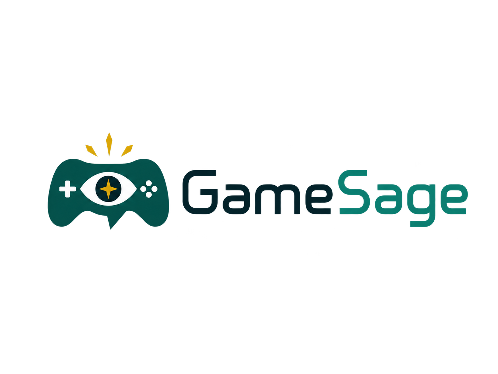
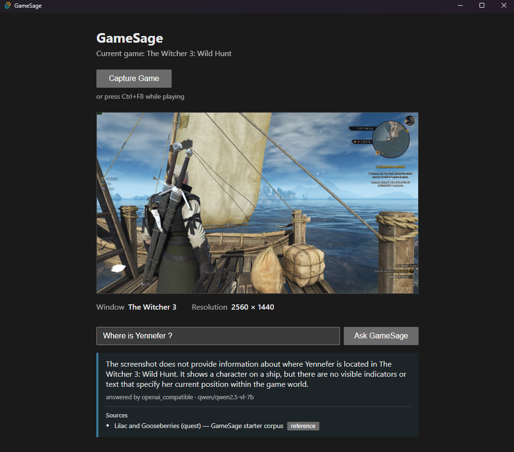
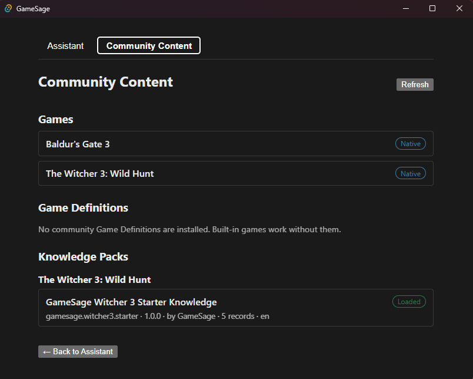

<p align="center">
  
</p>

<p align="center">
  <strong>Your open-source AI gaming companion.</strong>
</p>

GameSage captures what is happening in your game, understands it through a
vision model, retrieves relevant installed game knowledge, and answers
questions about your current situation — without making you leave the game.

It is designed around open community standards, so support for ordinary
games and their knowledge can be created and distributed independently of
GameSage itself. The Witcher 3 is the pilot game, not the architectural
scope: GameSage is built to become multi-game and community-extensible.

<p align="center">
  
</p>

## How it works

```text
Game
  → Capture Game / Ctrl+F8
  → Screenshot
  → Ask a question
  → Vision context
  → Knowledge retrieval
  → Answer with Sources
```

A screenshot always belongs to the game that produced it: questions are
answered with the knowledge installed for that game, never another game's.

## What works today

- Windows desktop app (Tauri 2 + React)
- Game selection, with native support for **The Witcher 3: Wild Hunt** and
  **Baldur's Gate 3**
- Additional games through community Game Definitions — no code changes
  required
- Game-window detection and on-demand capture (button or global **Ctrl+F8**)
- Screenshot preview with window title and resolution
- Contextual questions answered by a configurable vision model
- Provider-agnostic AI: OpenAI, OpenRouter, any OpenAI-compatible endpoint
  (including local models), or the Z.AI general API
- Local BM25 knowledge retrieval from installed Knowledge Packs, with
  Sources shown under answers
- Conversational session context: recent questions and answers give
  follow-up questions continuity, per game, runtime-only
- Read-only **Community Content** view with statuses and diagnostics for
  installed games, Game Definitions, and Knowledge Packs

## The community idea

GameSage maintains the engine and the community standards. The community
can maintain the content: game support, quests, guides, characters, items,
builds, mechanics, localization aliases, and mod-specific knowledge.

A GameSage maintainer does not need expert knowledge of every supported
game — and a game's community does not need to modify GameSage to support
it.

```text
                      GameSage
                         |
                Unified Game Registry
                 /                \
     Native GameAdapter      Game Definition
     (trusted Python)        (community, data-only)
                 \                /
                       game_id
                          |
                KnowledgePackRegistry
                          |
                   Knowledge Packs
```

`game_id` is the only link between game support and knowledge: any
Knowledge Pack declaring the same `game_id` as an installed game works
automatically, whether the game is native or community-defined.

<p align="center">
  
</p>

## Community standards

### Game Definition v1

A declarative, data-only `game.toml` that teaches GameSage to detect and
capture an ordinary game: executable names, simple window-title matching
(exact / starts-with / contains), display metadata, and compatibility
bounds. Drop it into a games directory and the game appears in GameSage.

Games needing special behavior can still be supported through trusted
native Python GameAdapters inside GameSage.

Specification: [docs/game-definitions-v1.md](docs/game-definitions-v1.md)

### Knowledge Pack v1

An external, portable, versioned, data-only knowledge format: a
`manifest.toml` describing the pack, a `corpus.jsonl` of records with
stable ids, localized aliases, tags, spoiler hints, and source
provenance, and an optional `NOTICE.md` for pack-level attribution and
licensing. Multiple packs per game are supported, with explicit conflict
diagnostics. GameSage-authored content goes through exactly the same
loader as third-party packs — no privileged path.

Specification: [docs/knowledge-packs-v1.md](docs/knowledge-packs-v1.md)

### Data only — by design

Game Definitions and Knowledge Packs are declarative data. They cannot
provide Python, JavaScript, DLLs, executables, shell scripts, or arbitrary
commands. GameSage interprets community data with trusted application
code; nothing from a community directory is ever executed.

## Installing community content

Windows user directories (create them if they don't yet exist):

```text
%LOCALAPPDATA%\GameSage\games\            Game Definitions
%LOCALAPPDATA%\GameSage\knowledge-packs\  Knowledge Packs
```

The workflow: download and extract community content (packs and
definitions may be distributed independently — for example through sites
such as Nexus Mods; GameSage does not download anything itself), place the
folder in the appropriate directory, and restart GameSage. The
**Community Content** view then shows every discovered game, Game
Definition, and Knowledge Pack with its version, author, record count
where available, and a **Loaded / Invalid / Incompatible / Conflict**
status plus a diagnostic when something is wrong. The view is currently
read-only: installing or removing content means managing the folders
yourself.

## Getting started (development)

GameSage is early-stage and currently Windows-only. You need:

- Windows
- Python 3.12
- Rust toolchain (for Tauri)
- Node.js and pnpm

```powershell
# Python core (from the repository root)
py -3.12 -m venv .venv
.venv\Scripts\pip install mss pytest

# Desktop app
cd apps\desktop
pnpm install
pnpm tauri dev
```

The desktop app uses the repository's `.venv` Python during development.
Standalone Python tools also work from the root, for example:

```powershell
.venv\Scripts\python -m companion.api games
.venv\Scripts\python -m tools.games validate path\to\a.definition
.venv\Scripts\python -m tools.knowledge validate path\to\a.pack
```

### AI configuration

Copy `.env.example` to `.env` in the repository root and configure one
provider. The OpenAI-compatible mode works for both local and compatible
remote servers, and the API key is optional for endpoints without
authentication:

```ini
GAMESAGE_AI_PROVIDER=openai_compatible
GAMESAGE_AI_BASE_URL=http://127.0.0.1:1234/v1
GAMESAGE_AI_MODEL=your-vision-model
GAMESAGE_AI_API_KEY=
```

OpenAI, OpenRouter, and the Z.AI general API are configured through their
own variables — see [.env.example](.env.example) for all options. No
commercial provider is required; provider and model are your choice.

## Architecture

```text
Python 3.12 core        detection, capture, vision providers,
                        knowledge packs, game registry, JSON API
Tauri 2 / Rust          desktop shell, global shortcut, thin bridge
React + TypeScript      assistant and community-content UI
pnpm                    frontend package management
```

The desktop boundary is deliberately simple: React invokes a Tauri
command, Rust spawns a one-shot Python subprocess, and structured JSON
flows back. No daemon, no HTTP server.

```text
React → Tauri/Rust → Python subprocess → JSON → Rust → React
```

Repository layout (short version):

```text
apps/desktop/     Tauri + React desktop application
companion/        Python GameSage core
knowledge_packs/  built-in starter Knowledge Pack
tools/            community-author CLI tooling
docs/             specifications and developer docs
tests/            Python tests
```

## Development verification

```powershell
# Python tests (repository root)
.venv\Scripts\python -m pytest

# Rust tests
cd apps\desktop\src-tauri ; cargo test

# Frontend type-check and build
cd apps\desktop ; pnpm build
```

## Project status

GameSage is under active development. Implemented today:

- Window detection, capture, and the global hotkey
- Native multi-game architecture (Witcher 3, Baldur's Gate 3)
- Community Game Definitions and Knowledge Packs (specification v1)
- Vision questions with provider choice, local or cloud
- Knowledge retrieval with Sources
- Community Content diagnostics

Planned, not yet implemented:

- Larger real knowledge libraries
- Simplified community-content installation
- Session memory
- Voice
- Overlay
- Automatic contextual/event detection

## Contributing

Contributions don't have to be code. You can:

- create **Game Definitions** for games you know
  ([spec](docs/game-definitions-v1.md));
- author **Knowledge Packs** — quests, characters, mechanics, builds
  ([spec](docs/knowledge-packs-v1.md));
- add localization aliases so an English corpus answers a French
  interface;
- improve documentation;
- contribute to the application itself (Python core, Rust bridge, React
  UI) — see [docs/adding-a-game.md](docs/adding-a-game.md) for how game
  support works internally.

## License

Not yet decided. GameSage application-code licensing is still an open
project decision. Knowledge Pack content carries its own licensing per
pack (see the Knowledge Pack specification's NOTICE conventions).
